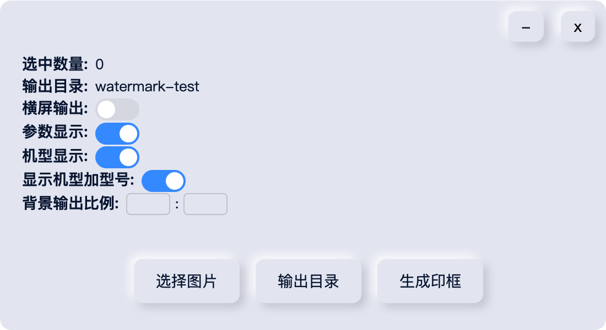
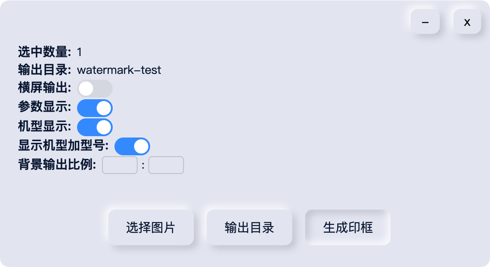

# 壹印

> 这是一个直接生成图片印框的工具
>
> 无任何水印，本软件始终开源免费

## 使用

直接安装并打开软件

**参数解释：**

1. 选中数量 - 当前选中图片的数量
2. 输出目录 - 生成印框后输出的图片的目录，点击可以快速打开目录
3. 横屏输出 - 软件自己判断宽高比，将图片进行背景横向输出，适合竖图生成横屏图片
4. 参数显示 - 是否显示快门、ISO、光圈信息
5. 机型显示 - 是否显示机型和型号
6. 显示机型加型号 - 关闭后将不显示机子型号
7. 背景输出比例 - 默认不启用，用于设置整体图片的输出比例

设置好选项后选择图片并点击生成印框即可输出图片

最终效果图

竖图输出

竖图转横图输出

## 结尾

> 本软件是作者针对 Nikon Z30 相机图片临时做的一个印框生成软件
>
> 所以不保证其它的相机的图片输出的信息正确，如果出现输出的信息不对
>
> 可以提ISSUES建议
>
> 如果需要软件功能有不太好的地方也可以提建议
